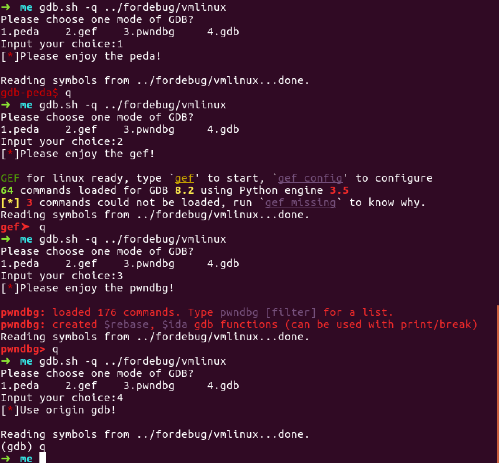

# gdb-extension-selector
gdb extension selector


## setting

* to install some extension

    ```sh
    ./setup.sh
    ```

* or just add gdb.sh to your PATH,then set extension location correctly

    in `gdb.sh` line `6`
    ```sh
    # set with your own location
    peda="source ~/peda/peda.py"
    gef="source ~/.gdbinit_gef"
    pwndbg="source ~/pwndbg/gdbinit.py"
    ```

## usage
just like gdb

```sh
gdb.sh [OPTION...] YOUR_DEBUG_FILE
```

## gdb extension

- [x] [peda](https://github.com/longld/peda)
- [x] [pwndbg](https://github.com/pwndbg/pwndbg)
- [x] [gef](https://github.com/hugsy/gef)

## show:heart_eyes::heart_eyes:



## reference

https://blog.csdn.net/Maxmalloc/article/details/83688374